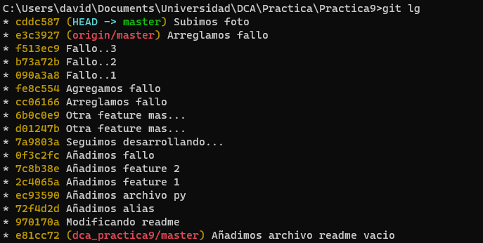
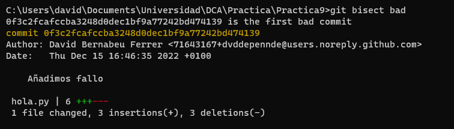
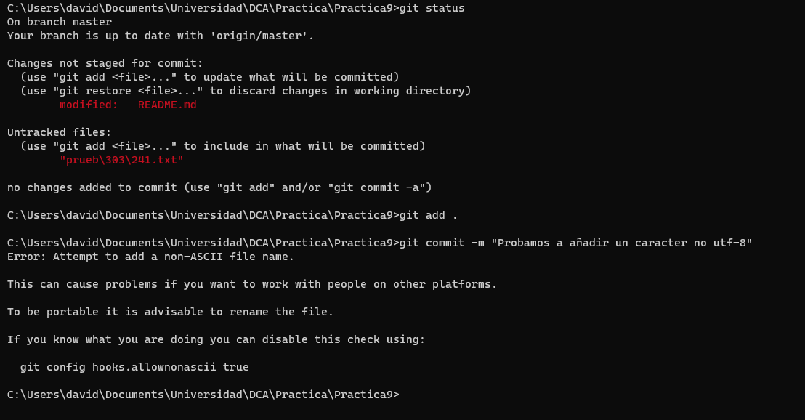
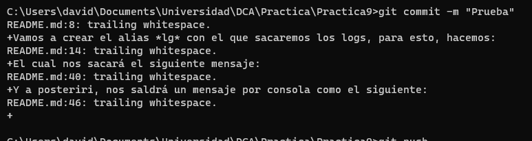

# DCA: Práctica 9 - Git.

### Apartado 1. Crear cuenta de GitHub.
Cuenta de GitHub creada, la cuenta es la siguiente: https://github.com/dvddepennde

Enlace a github de la práctica: https://github.com/dvddepennde/dca_practica9
### Apartado 2. Creación de alias locales y globales.

Vamos a crear el alias *lg* con el que sacaremos los logs, para esto, hacemos:  

```shell
git config --local alias.lg "log --oneline --decorate --graph"
```

El cual nos sacará el siguiente mensaje: 



Para crear el alias global status, ejecutamos:

```shell
git config --global alias.st "status"
```

y si ejecutamos:
```shell
git st
```
### Uso de git bisect

Para esto, hacemos varios commits, introducimos un fallo y a posteriori hacemos mas commits.

```shell
git bisect start
git bisect good 7c8b38e
git bisect bad 6b0c0e9
git bisect bad
git bisect bad
```

Y a posteriori, nos saldrá un mensaje por consola como el siguiente:



 ## Hooks
 He activado el hook pre-commit que viene de ejemplo, el cual no permite subir archivos que tengan carácteres no ASCII, por ejemplo, las tildes.
 
 En caso de intentar subir un archivo con caracter no ASCII, el mensaje será el siguiente:

 

Además, tambien verifica que no hayan espacios en planco antes de un salto de línea, por ejemplo, sacaría el siguiente mensaje:

 

## David Bernabeu Ferrer - 29577349Q